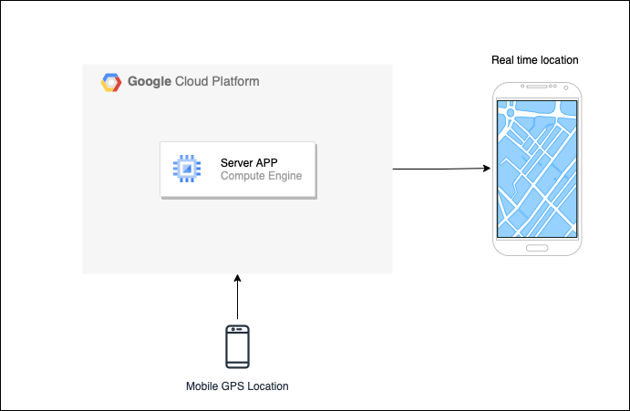

# RTAPP
## An app to display real-time location of exposition owner in a Chilean Museum.

This project is a part of a museum exposition called [Hechizas](https://mac.uchile.cl/exposiciones/hechizas/) in Contemporany Art Museum.  
This is a cellphone mounted on a wall that shows real time location of the exposition owner with a small desviation. 

## Built with:
 - Google Cloud Platform
 - [Pyicloud](https://pypi.org/project/pyicloud/)
 - Node.JS
 - React & [Leaflet](https://leafletjs.com) components
 - Vercel

## Description

It has three componentes:
 - **Source owner Iphone**: RTAPP access to real time coordinates mobile using [pyicloud](https://pypi.org/project/pyicloud/) through the server.
 - **Node.JS server on GCP**: A background process in Python access to pyicloud API and store the current coordinates of exposition owner on a file. A Node.JS API expose an endpoint to consume an encrypted version of owner location. Both components are mounted on a GCP Engine Compute instance.
 - **Target exposition Iphone**: A web app built in React and [Leaflet](https://leafletjs.com) deployed to Vercel, display a Leaflet map that shows the real time position of expoistion owner with a small desviation using noise for security reasons. It updates every 5 seconds calling previuos described API.  
 
 ## Diagram
 
 Project goes as following:  
 
 
 ## FAQ
- **Why pyicloud instead a native iOS map?**  
Factors to be considerated in source mobile includes battery consumption. A React Native app running 24/7 in background that consume GPS location and send them to a server has a significantly impact on battery drain. This will make an unestable coordinates flow to the exposition.

- **Did exposition owner share their iCloud credentials?**  
Credentials are stored in keyrings and the access to VM are restricted. No one has access to iCloud password even devs.
